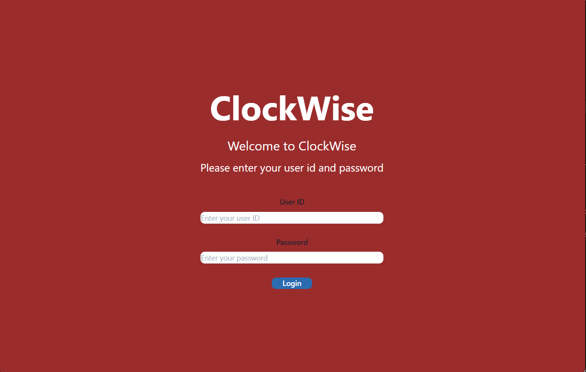

# ClockWise

## Description
As an employee, I want to be able to clock in and out so that I can keep track of how many hours I work per week. As a group, we improved our skills with the MVC pattern. Each of us took on leadership roles in models, controllers, and views and we worked together to debug and test the web application. We were able to gain a better understanding of Day.js, Moment.js, and TailWind for styling purposes. We worked well as a team to handle merge conflicts andgit a other errors.

## Table of Contents
- [Installation](#installation)
- [Usage](#usage)
- [Collaborators](#collaborators)
- [Credits](#credits)
- [Tests](#tests)
- [Questions](#questions)

## Installation
Download the application from Heroku and Insomnia, run npm i to install dependencies (bcrypt, connect-session-sequelize, dotenv, express, express-handlebars, express-session, handlebars, moment, mysql2, and sequelize). 

## Usage
Login with your employee ID number and password. From there, you will be able to clock in or out, as well as review your time card. 

Heroku link: 

## Collaborators
- Heather Crawford @eagersidekick
- Timber Middlebrooks @TimbirICT
- Travis Shanhun @shanhunCodes
- Anna Turner @AnnaT7459

## Credits
M. Mayfield debugging (personal communication, January 7, 2024)
B. Crawford time event routes-finding time events by their date(personal communication, January 10, 2024)
J. Diehl debugging route (personal communcation, January 8, 2024)
A. Hudgins debugging logins (personal communication, January 8, 2024)

## Tests
Run routes through Insomnia. For example:
Users:
Click New Request, use the dropdown menu to select:
- GET and enter http://localhost:3001/api/users. Click Send and you will be able to see all of the employees in the database. 
- POST and enter the same link. Click the Body and in the dropdown menu select JSON. As an object enter in a "name": "", "email": "", "password": "" and click Send. It will give the new employee an id number and a hashed password. 
Time Cards:
Click New Request, use the dropdown menu to select:
- GET and enter http://localhost:3001/api/timecards. Click send and you will be able to see all of the timecards for the employees, you can also add /(an employee id number) to view a specific employee's timecard.

## Questions
For any questions, please contact me at GitHub Handles: Heather Crawford @eagersidekick, Timber Middlebrooks @TimbirICT, Travis Shanhun @shanhunCodes, and Anna Turner @AnnaT7459

---

*This README was generated with a README generator*
